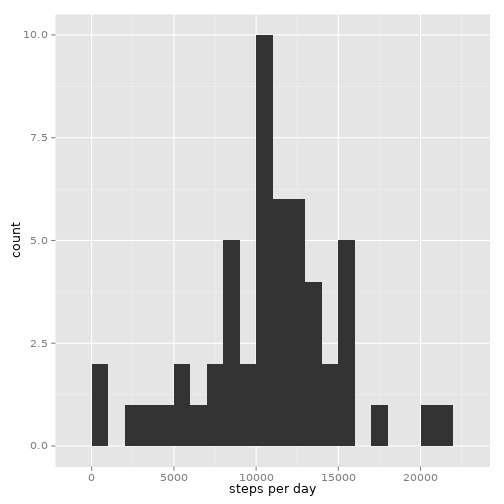
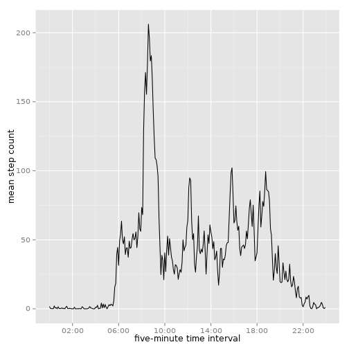
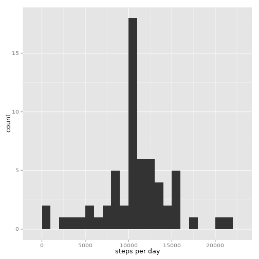
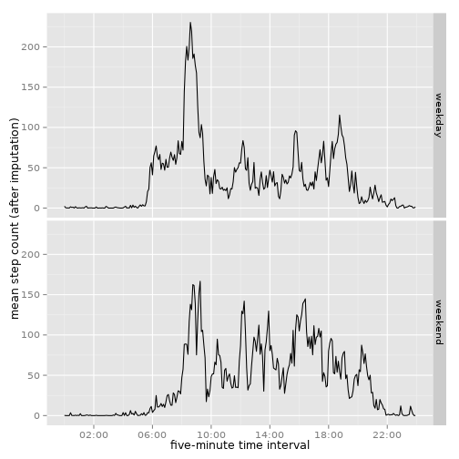

```r
library(scales)
suppressPackageStartupMessages(library(dplyr))
library(ggplot2)
```

## Loading and preprocessing the data

Read the data and parse the time.


```r
d <- read.table("activity.csv", sep=",", header=TRUE, stringsAsFactors=FALSE)
d$time <- with(d, sprintf("%02d:%02d", interval %/% 100, interval %% 100))
d$datetime <- with(d, as.POSIXct(paste(date, time, sep=" "), format="%F %R"))
d$time <- as.factor(d$time)
d$date <- as.factor(d$date)
d <- select(d, datetime, date, time, steps)
str(d)
```

```
## 'data.frame':	17568 obs. of  4 variables:
##  $ datetime: POSIXct, format: "2012-10-01 00:00:00" "2012-10-01 00:05:00" ...
##  $ date    : Factor w/ 61 levels "2012-10-01","2012-10-02",..: 1 1 1 1 1 1 1 1 1 1 ...
##  $ time    : Factor w/ 288 levels "00:00","00:05",..: 1 2 3 4 5 6 7 8 9 10 ...
##  $ steps   : int  NA NA NA NA NA NA NA NA NA NA ...
```


## What is mean total number of steps taken per day?


```r
e <- summarize(group_by(d, date), sum_steps=sum(steps))
ggplot(e, aes(x=sum_steps)) + geom_histogram(binwidth=1000) + xlab("steps per day")
```

 


```r
sprintf("mean=%d, median=%d",
        round(mean(e$sum_steps, na.rm=TRUE)),
        median(e$sum_steps, na.rm=TRUE))
```

```
## [1] "mean=10766, median=10765"
```


## What is the average daily activity pattern?


```r
e <- summarize(group_by(d, time), mean_steps=mean(steps, na.rm=TRUE))
ggplot(e, aes(x=as.POSIXct(time, format="%R"), y=mean_steps, group=1)) +
    geom_line() +
        scale_x_datetime(breaks = "4 hours", labels=date_format("%R")) +
            xlab("five-minute time interval") + ylab("mean step count")
```

 


```r
sprintf("time interval containing the maximum step count (on average): %s (start point)",
        as.character(e[which.max(e$mean_steps),]$time))
```

```
## [1] "time interval containing the maximum step count (on average): 08:35 (start point)"
```


## Imputing missing values


```r
sprintf("total number of rows having missing values: %d", sum(is.na(d$steps)))
```

```
## [1] "total number of rows having missing values: 2304"
```

Simple imputation: replace missing values by means.


```r
f <- left_join(mutate(d, id=as.character(time)),
               mutate(e, id=as.character(time)), by="id")
d$steps_imputed <- with(f, ifelse(is.na(steps), round(mean_steps), steps))
str(d)
```

```
## 'data.frame':	17568 obs. of  5 variables:
##  $ datetime     : POSIXct, format: "2012-10-01 00:00:00" "2012-10-01 00:05:00" ...
##  $ date         : Factor w/ 61 levels "2012-10-01","2012-10-02",..: 1 1 1 1 1 1 1 1 1 1 ...
##  $ time         : Factor w/ 288 levels "00:00","00:05",..: 1 2 3 4 5 6 7 8 9 10 ...
##  $ steps        : int  NA NA NA NA NA NA NA NA NA NA ...
##  $ steps_imputed: num  2 0 0 0 0 2 1 1 0 1 ...
```


```r
e <- summarize(group_by(d, date), sum_steps_imputed=sum(steps_imputed))
ggplot(e, aes(x=sum_steps_imputed)) + geom_histogram(binwidth=1000) +
    xlab("steps per day")
```

 

Imputation did not affect the mean, but it slightly changed the median:


```r
sprintf("after imputation: mean=%d, median=%d",
        round(mean(e$sum_steps_imputed)),
        median(e$sum_steps_imputed))
```

```
## [1] "after imputation: mean=10766, median=10762"
```


## Are there differences in activity patterns between weekdays and weekends?

Introduce a factor variable indicating weekends


```r
is.weekend <- function(dt) { weekdays(dt) %in% c("Saturday", "Sunday") }
d$daytype <- as.factor(ifelse(is.weekend(d$datetime), "weekend", "weekday"))
```

Form a group for each combination of daytype and time, and compute the
mean of the number of steps within each group


```r
e <- group_by(d, daytype, time) %>%
    summarize(mean_steps_imputed=mean(steps_imputed))
```

Plot the mean step count for each of the factors


```r
ggplot(e, aes(x=as.POSIXct(time, format="%R"),
              y=mean_steps_imputed, group=1)) +
    geom_line() + facet_grid(daytype ~ .) +
        scale_x_datetime(breaks = "4 hours", labels=date_format("%R")) +
            xlab("five-minute time interval") +
                ylab("mean step count (after imputation)")
```

 
